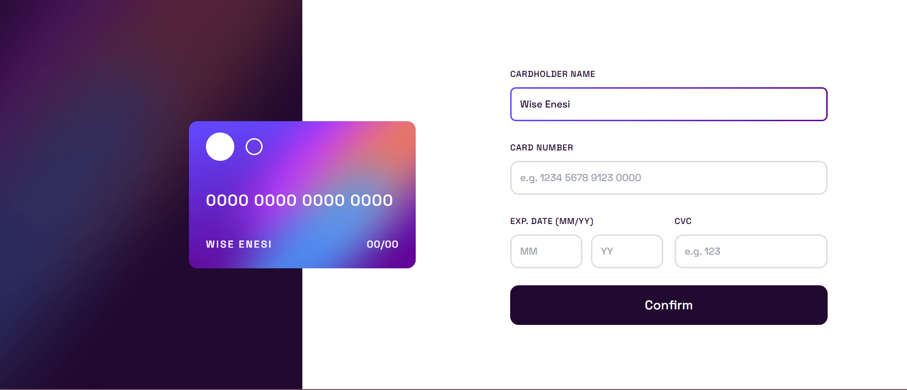
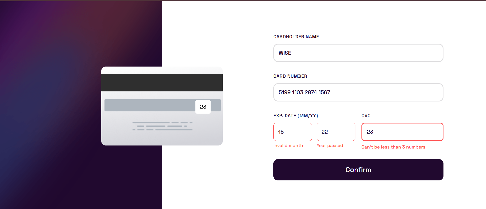
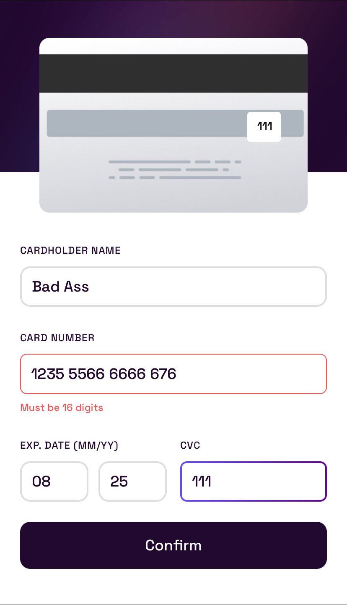
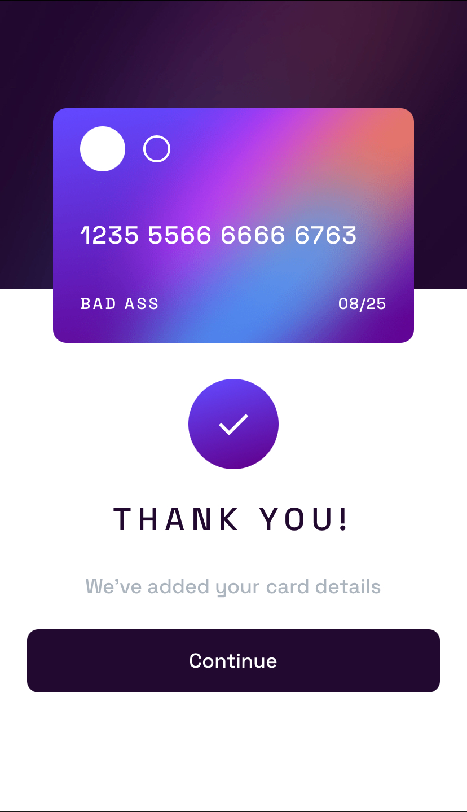

# 💳 Interactive Card Details Form

A responsive React app where users can fill in their card details and see them update in real time on a virtual
credit card.

---

## 📋 Overview

This is an interactive card details form built with React + TypeScript and styled with Tailwind CSS.  
The app handles real-time validation, dynamic card updates, and adapts beautifully across desktop and mobile screens.

---

### ✅ The challenge

Users should be able to:

- Fill in the form and see the card details update in real-time
- Receive error messages when the form is submitted if:
  - Any input field is empty
  - The card number, expiry date, or CVC fields are in the wrong format
- View the optimal layout depending on their device's screen size
- See hover, active, and focus states for interactive elements on the page
- See a custom 404 page for unknown routes

---

## 🚀 Live Demo

Click to view the live site 👉🏼 

---

## 🖼️SCREENSHOTS

### 💻 Desktop View

### 📱 Mobile View

---

## 🛠 My process

- Designed and coded responsive components (CreditCard, CardForm, etc.)
- Used React state hooks to handle form data and validation
- Integrated custom validation and real-time feedback
- Configured Vite + React + TypeScript + Tailwind CSS
- Deployed to GitHub Pages, handled base path and fallback routing

---

### ⚙️ Built with

- [React](https://reactjs.org/) & [TypeScript](https://www.typescriptlang.org/)
- [Vite](https://vitejs.dev/)
- [Tailwind CSS](https://tailwindcss.com/)
- [React Router DOM](https://reactrouter.com/)
- [Radix UI](https://www.radix-ui.com/) for accessible UI components
- [gh-pages](https://www.npmjs.com/package/gh-pages) for deployment

---

### 📚 What I learned

- Configuring React Router to work with GitHub Pages (using `basename`)
- Adding a `404.html` fallback to support client-side routing
- Dynamically loading images from the `public` folder to work both locally and in production
- Using Tailwind CSS to create responsive, mobile-first designs quickly

---

### 🚀 Continued development

- Improve accessibility with ARIA labels
- Add real-time formatting and masking of card inputs
- Write unit and integration tests for components
- Animate card flipping and transitions for better UX

---

## 👤 Author

- Name: **Enesi Wise**
- GitHub: [@enesiwise](https://github.com/enesiwise)

---

> ⚡ _Built with ❤️ and React!_
