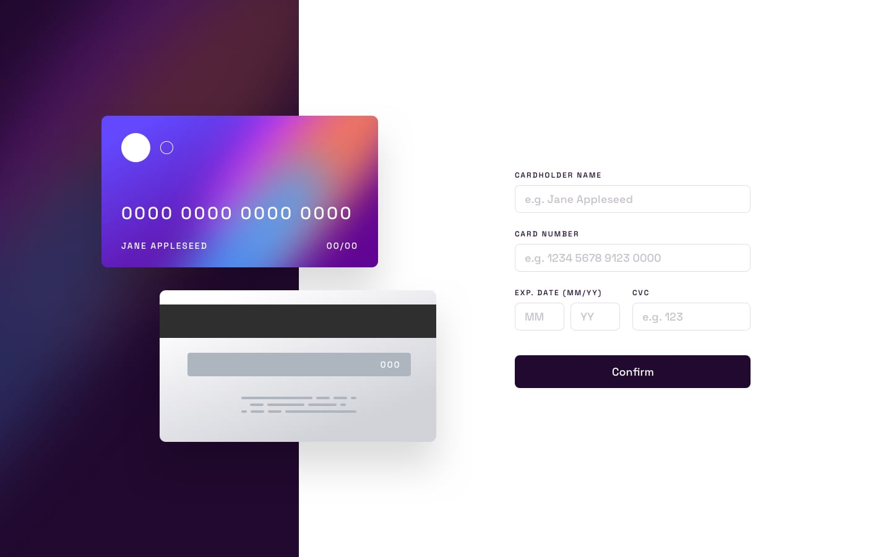

# Frontend Mentor - Interactive card details form solution

This is a solution to the [Interactive card details form challenge on Frontend Mentor](https://www.frontendmentor.io/challenges/interactive-card-details-form-XpS8cKZDWw). Frontend Mentor challenges help you improve your coding skills by building realistic projects.

## Table of contents

- [Overview](#overview)
  - [The challenge](#the-challenge)
  - [Screenshot](#screenshot)
  - [Links](#links)
- [My process](#my-process)
  - [Built with](#built-with)
  - [What I learned](#what-i-learned)
  - [Continued development](#continued-development)
- [Author](#author)

## Overview

### The challenge

Users should be able to:

- Fill in the form and see the card details update in real-time
- Receive error messages when the form is submitted if:
  - Any input field is empty
  - The card number, expiry date, or CVC fields are in the wrong format
- View the optimal layout depending on their device's screen size
- See hover, active, and focus states for interactive elements on the page

### Screenshot



### Links

- Live Site URL: [Add live site URL here](https://your-live-site-url.com)

## My process

### Built with

- Semantic HTML5 markup
- CSS custom properties
- Flexbox
- CSS Grid
- Mobile-first workflow
- [React](https://reactjs.org/) - JS library
- [TypeScript](https://www.typescriptlang.org/) - For type safety
- [Tailwind CSS](https://tailwindcss.com/) - For styles
- [React Hook Form](https://react-hook-form.com/) - For form handling
- [Zod](https://zod.dev/) - For form validation
- [Vite](https://vitejs.dev/) - Build tool

### What I learned

This project helped me practice form validation and real-time updates between form inputs and visual elements. I learned how to:

- Implement real-time form validation with proper error handling
- Format credit card inputs (number spacing, expiry date formatting)
- Create responsive layouts that work well on both mobile and desktop
- Use React Hook Form with Zod for robust form validation
- Handle complex state management for real-time card preview updates

```tsx
// Example of real-time card number formatting
const formatCardNumber = (value: string) => {
  const cleaned = value.replace(/\s/g, "");
  const formatted = cleaned.replace(/(.{4})/g, "$1 ");
  return formatted.trim();
};
```

### Continued development

In future projects, I want to continue focusing on:

- Advanced form validation patterns
- Animation and micro-interactions
- Accessibility improvements for form elements
- Testing strategies for form components

## Author

- Frontend Mentor - [@yourusername](https://www.frontendmentor.io/profile/yourusername)